### test_1.py

`test_1.py`

```
from fastapi import FastAPI

app = FastAPI()


@app.get("/")
async def root():
    return {"message": "Hello World"}
```

cmd : `python3 -m uvicorn main:app --reload` 


- 데코레이터에서 CRUD 사용 가능
  - `POST` : 데이터를 생성하기 위해
  - `GET` : 데이터를 읽기 위해
  - `PUT` : 데이터를 업데이트하기 위해
  - `DELETE` : 데이터를 삭제하기 위해

```
@app.post()
@app.put()
@app.delete()
```

- 경로 : `/` 을 기준으로 나뉨
  - "/" 만 입력했을 경우 `localhost:port`
  - "/test/1" : `localhost:port/test/1` 

- `async def` 대신 일반함수 `def` 도 가능

- return 값
  - dict, list, (단일 값)str, (단일 값)int 등 반환 가능

---

### test_2.py
```
from fastapi import FastAPI

app = FastAPI()


@app.get("/items/{item_id}")
async def read_item(item_id):
    return {"item_id": item_id}
```

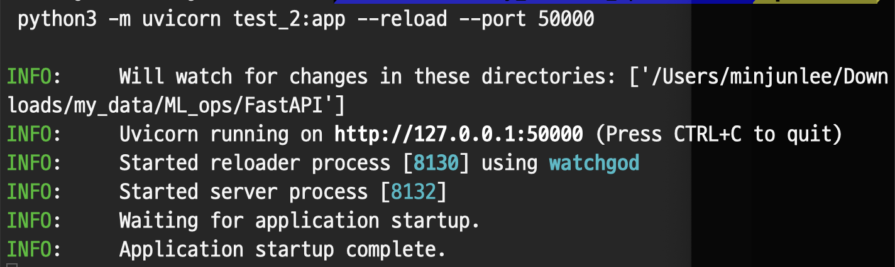


- 경로를 매개변수로 받을 수 있음

**타입이 있을 경우**
```
async def read_item(item_id: int):
```

위와 같이 넣어줄 수 있음.

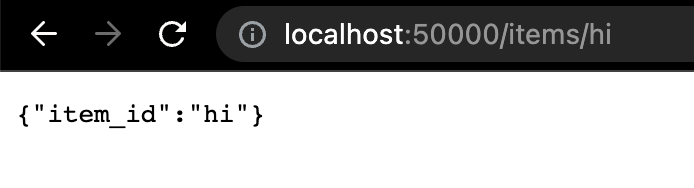

- 만약 데이터 검증을 위해 `item_id : int` 를 넣어주었다면

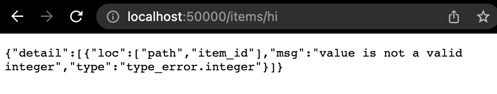
- 다음과 같이 에러메시지 출력

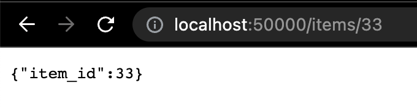
- 정상입력한 경우


- `localhost:port/docs` 를 들어가면
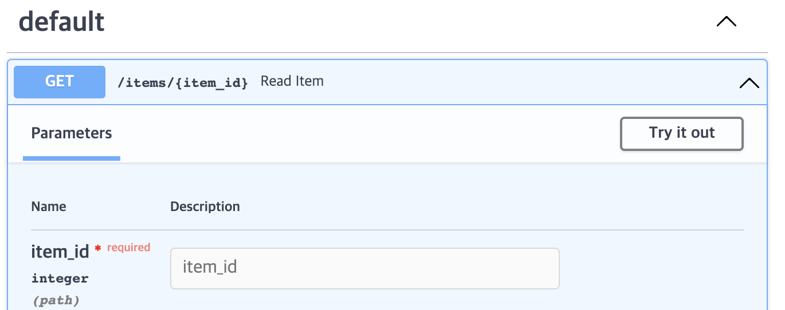

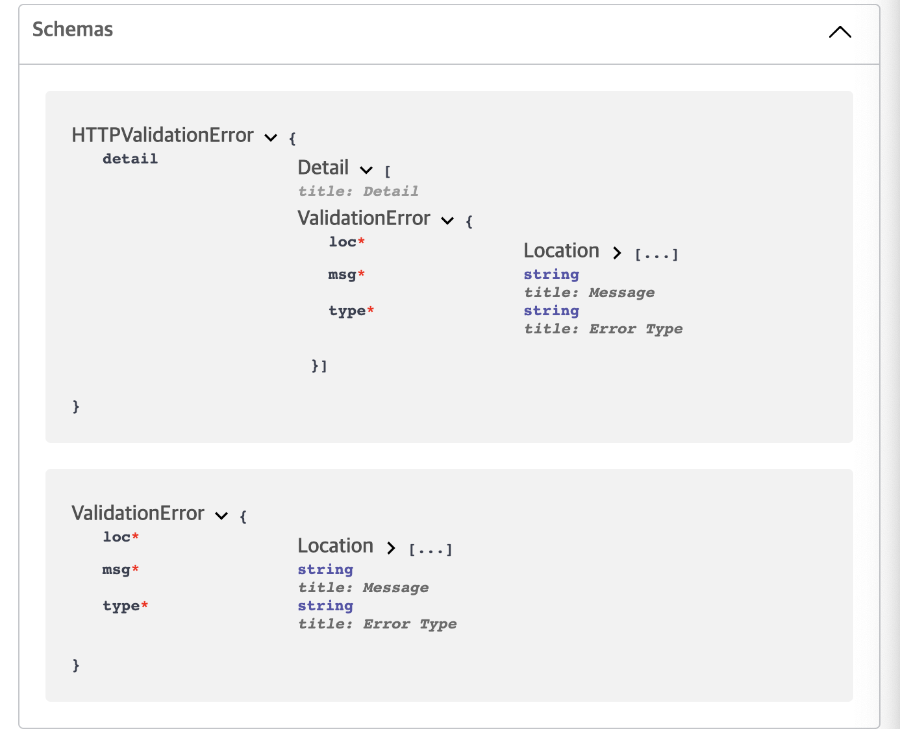
- `requirement` 와 `error log` 를 확인 할 수 있음

---
### test_3.py
```
from fastapi import FastAPI

app = FastAPI()


@app.get("/users/me")
async def read_user_me():
    return {"user_id": "the current user"}


@app.get("/users/{user_id}")
async def read_user(user_id: str):
    return {"user_id": user_id}
```

- 순서 문제

만약 위의 `/users/me` 처럼 현재 사용자의 데이터를 가져온다고 할 경우

`/users/{user_id}` 보다 먼저 선언해주어야 함

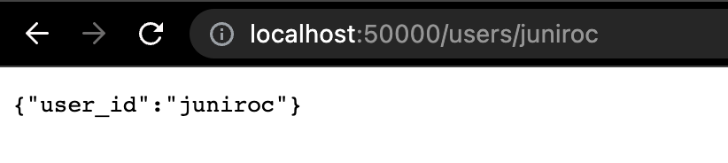

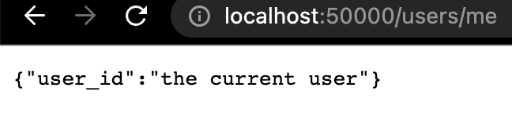


### test_4.py

- 또는 `Enum` 클래스를 이용해 미리 매개변수들을 정의할 수 있음

```
from enum import Enum

from fastapi import FastAPI


class ModelName(str, Enum):
    alexnet = "alexnet"
    resnet = "resnet"
    lenet = "lenet"


app = FastAPI()


@app.get("/models/{model_name}")
async def get_model(model_name: ModelName):
    if model_name == ModelName.alexnet:
        return {"model_name": model_name, "message": "Deep Learning FTW!"}

    if model_name.value == "lenet":
        return {"model_name": model_name, "message": "LeCNN all the images"}

    return {"model_name": model_name, "message": "Have some residuals"}
```

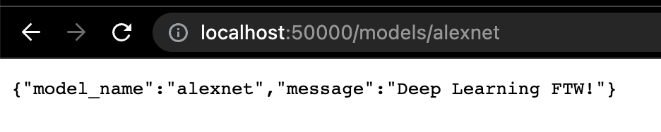

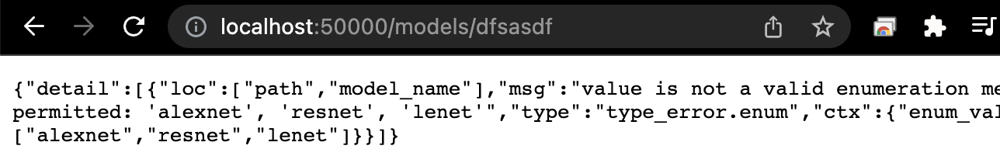
- 이외의 값일 경우의 error messege

- `localhost:port/docs` 접속할 경우
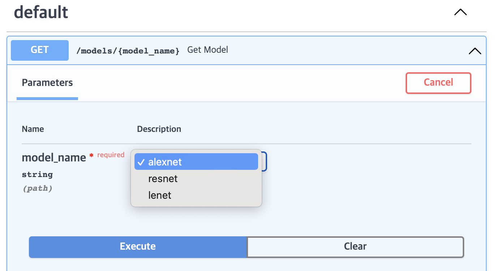

또는 다음과 같은 방법으로 확인도 가능
- `if model_name.value == "lenet":`

```
@app.get("/models/{model_name}")
async def get_model(model_name: ModelName):
    if model_name == ModelName.alexnet:
        return {"model_name": model_name, "message": "Deep Learning FTW!"}

    if model_name.value == "lenet":
        return {"model_name": model_name, "message": "LeCNN all the images"}

    return {"model_name": model_name, "message": "Have some residuals"}
```

---
### test_5.py
- `txt file` 같은 경로를 매개변수로 넣는 경우
```
from fastapi import FastAPI

app = FastAPI()


@app.get("/files/{file_path:path}")
async def read_file(file_path: str):
    with open(file_path) as f:
        lines = f.readlines()
    return {"file_path": lines}

```

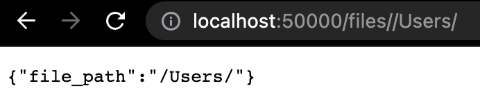
- 위와같이 `/` 를 2개 넣어주어야 함

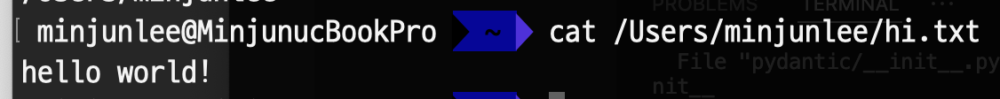
- 다음과 같이 txt 파일을 만들고

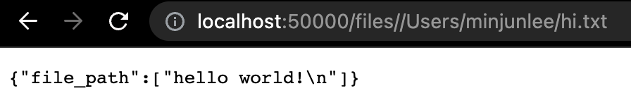
- file_path를 입력해주면 출력됨
