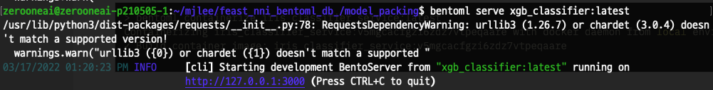
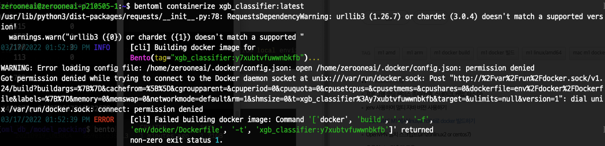
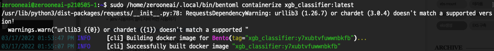
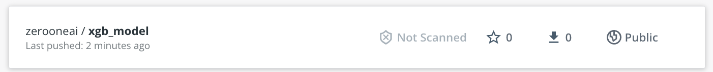
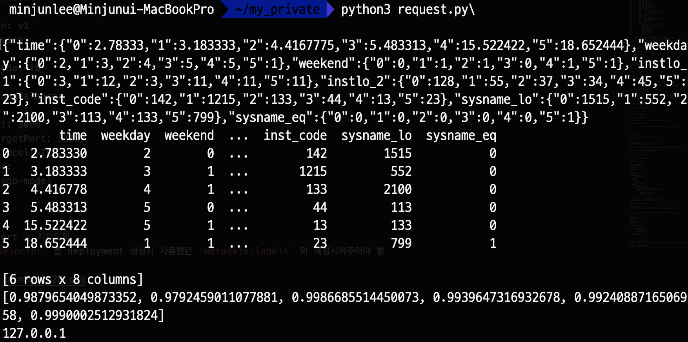

## Yatai-BentoML

- On-premise K8s 에 BentoML을 띄우기 위해 Yatai-bentoml 을 이용

### why?
Yatai 가 K8s native 하기 때문

- 이때 사내 On-premise K8s 를 이용하기 때문에 문서에 나온 \
`http://yatai.127.0.0.1.sslip.io` 를 이용하면 안됨

- 대신 Port-forwarding 을 통해 접근


- `yatai-system` namespace 에서 `yatai` 라는 service 를 열어주면 된다

- initial id : `admin` / initial password : `admin`

접속을 하면 다음과 같이 나옴


`model_packing_save.py`
```
import torch
import lightgbm as lgb
import pandas as pd
import bentoml
import xgboost

# get_model
mo_ = torch.load('./models/xgb_model.pth.tar')['model']

# dr_lauren_classifier와 'model'로 패키징됨
bentoml.xgboost.save('xgb_model', mo_)

```
- 이때 반드시 xgboost 나 Lgbm 등 로드하는 모델의 패키지 버전을 학습할 때와 똑같이 맞춰야 한다. \
-> 이걸로 삽질을 상당히 오래함..

- 모델 저장 python 파일 작성
- 기존 보다 단순해짐 해당 모델에 맞는 라이브러리 불러와서 bentoml.{library}.save('{save_name}', model) 로 작성 가
- `python3 model_packing_save.py` 으로 실행 


- 위와 같이 실행 완료 메시지가 나오며
- `~/bentoml/models` 를 확인해보면 `save_name` 으로 폴더가 생성된 것을 확인 가능


`bentoml directory tree`


`model.yaml`
```
name: xgb_model
version: 47bkkuve6kwnbkfb
bentoml_version: 1.0.0a6
creation_time: 2022-03-16 06:32:51.898751+00:00
api_version: v1
module: bentoml._internal.frameworks.xgboost
context:
  framework_name: xgboost
  pip_dependencies:
  - xgboost==1.4.2
  bentoml_version: 1.0.0a6
  python_version: 3.8.0
labels: {}
options: {}
metadata: {}
```

- `bentoml models list` 명령어로도 확인 가능


`service.py`
```
import numpy as np
import pandas as pd
import bentoml
import xgboost
from bentoml.io import NumpyNdarray, PandasDataFrame

# Load runner for the latest lightgbm model 
xgb_runner = bentoml.xgboost.load_runner("xgb_model:latest")

# Creating 'lgbm_classifier' service 
xgb_model = bentoml.Service("xgb_classifier", runners=[xgb_runner])

# Create API function and setting input format
@xgb_model.api(input=PandasDataFrame(), output=NumpyNdarray())
def predict(input_arr):
    res = xgb_runner.run_batch(input_arr)  
    return res
```


- 위처럼 `service.py` 파일을 실행할 필요는 없음

- `bentoml serve ./service.py:xgb_model --reload` 명령어를 통해 모델 서


- 위와같이 나오면 Serving 이 완료된 것

- `request.py` 파일을 생성하여 REST로 요청하는 모듈을 생성해준다.

`request.py`
```
import requests
import pandas as pd

df= {'time' : [2.78333, 3.183333, 4.4167775, 5.483313, 15.522422, 18.652444], 
     'weekday' : [2, 3, 4, 5, 5, 1], 
     'weekend' : [0, 1, 1, 0, 1, 1], 
     'instlo_1': [3, 12, 3, 11, 11, 11],
     'instlo_2': [128, 55, 37, 34, 45, 23],
     'inst_code' : [142, 1215, 133, 44, 13, 23], 
     'sysname_lo': [1515, 552, 2100, 113, 133, 799], 
     'sysname_eq' : [0, 0, 0, 0, 0, 1]}
df_ = pd.DataFrame(df)

arr = df_.to_numpy()[0]

print(df_)
response = requests.post(
    "http://127.0.0.1:3000/predict",
    headers={"content-type": "application/json"},
    data=df_.to_json())

print(response.text)
```

- 이때 우리는 DataFrame 형식으로 제출하기로 했지만 data에 df_.to_json() 으로 변환해서 넣어주어야 함.

- `python3 request.py` 명령어 실행


- 위와 같이 결과가 return 되는 것을 확인할 수 있음

`serving server log`

- 서빙하는 곳에서 로그 확인도 가능하다

- 끝.. 난줄 알았지만 이제 시작.. Containerize 하여 K8s 위에 올려야 한다.


- 모델을 서비스에서 바로 서빙하는 방법 말고 벤토로 빌드시켜놓을 수도 있음.

`bentofile.yaml`
```
service: "service.py:xgb_model"
description: "file: ./README.md"   # 해당내용은 설명 내용을 적어둠
labels:
    owner: mj-lee
    stage: demo
include:
  - "*.py"   # bentoml 에 어떤 파일을 넣을지 매칭시킬 패턴 (이후 벤토파일로 해당 패턴과 일치하는 파일들이 옮겨짐 뒤에 캡쳐 확인)
python:
  packages:    # 사용할 패키지
    - scikit-learn
    - pandas
    - xgboost
    - numpy
    - torch
```

- `bentofile`을  작성했다면
- `bentoml build` 명령어 실행


- 위와같이 성공했다면, `bentoml list` 명령어 를 통해 `bento list`를 확인


- `~/bentoml/bentoms` 디렉토리를 확인해보면 다음과 같은 구조로 생성되어있음
```
bentoml
├── bentos
    └── xgb_classifier
        ├── latest
        └── y7xubtvfuwwnbkfb
            ├── apis
            │   └── openapi.yaml
            ├── bento.yaml
            ├── env
            │   ├── conda
            │   ├── docker
            │   │   ├── Dockerfile
            │   │   ├── entrypoint.sh
            │   │   └── init.sh
            │   └── python
            │       ├── requirements.lock.txt
            │       ├── requirements.txt
            │       └── version.txt
            ├── models
            │   └── xgb_model
            │       ├── 47bkkuve6kwnbkfb
            │       └── latest
            ├── README.md
            └── src
                ├── model_packing_save_2.py
                ├── model_packing_save.py
                ├── pack_.py
                ├── request.py
                ├── service_2.py
                ├── service.py
                └── test.py
```
- 우선 최하위 directory 인 `src`에 패턴과 일치하는 파일들이 옮겨져 있음
- `bentofile`에서 작성해준 `README.md` 파일 생성
- `models` directory 는 이전에 `service.py`를 그냥 실행했을 떄와 같은 `directory` 생성
- `docker` directory를 보면 이후에 컨테이너화 할 때 쓰일 `Dockerfile` 존재


- 같은 방법으로 list 목록에 있는 bento model 을 서빙해줄 수 있음
- bentoml serve xgb_classifier:latest



- 인퍼런스 시도


---

- 빌드를 완료하였으니, Docker Image로 Containerize
- 단순히 `bentoml list` 에 있는 내용을 그대로 이용

- `bentoml list`


- `bentoml containerize xgb_classifier:latest` 명령어로 컨테이너 화



- 그런데 도커 내 permission 권한으로 인해 실행이 안됨


- `sudo bentoml containerize xgb_classifier:latest` 를 실행해도


- 다음과 같이 해결이 안됨

- 이럴 때는 `whereis` 명령어를 이용해 설치된 위치 알아내기

- `whereis bentoml`


- `sudo <path_bentoml> containerize xgb_classifier:latest` 명령어를 이용해 컨테이너화 시킴


- 성공적으로 작동함을 알 수 있음

- `sudo docker images | grep xgb`


- 이지미 생성 완료됨

- `sudo docker run -p 3000:3000 xgb_classifier:<TAG>`


- 이때 반드시 `-p 3000:3000` 으로 포트를 연결해주어야 인퍼런스 가능


---

### Serving To K8s

- 도커 이미지 푸시해주기 위해 TAG 재설정

```
sudo docker login
# 사내 계정인 zerooneai 로 접속

sudo docker tag xgb_classifier:y7xubtvfuwwnbkfb zerooneai/xgb_model:0.0.0

sudo docker push zerooneai/xgb_model:0.0.0
```




`deploy_model.yml`
```
apiVersion: apps/v1
kind: Deployment
metadata:
  name: xgb-model
spec:
  replicas: 3
  selector:
    matchLabels:
      app: xgb-model
  template:
    metadata:
      labels:
        app: xgb-model
    spec:
      containers:
        - name: xgb-model-init
          image: zerooneai/xgb_model:0.0.0
          ports:
            - containerPort: 3000
              protocol: TCP
```

- `deployment` 를 생성해줄 yml 파일 생성
`kubectl apply -f deploy-model.yml`


- pod 3개 생성됨
- 뒤쪽을 보면 노드가 3, 4, 1 번 노드로 분산되어있음을 확인


- `service` 를 외부에서 요청 가능하도록 `LoadBalancer` 로 생성
`service-lb.yml`
```
apiVersion: v1
kind: Service
metadata:
  name: model-lb
spec:
  type: LoadBalancer
  ports:
    - port: 3000
#      targetPort: 31000
      protocol: TCP
  selector:
    app: xgb-model

```

- targetPort 는 지워도됨
- 여기서 `selector` 를 deployment 생성시 사용했던 `metadata.labels` 와 매칭시켜주어야 함


- 추가로, 미크로틱을 열어주었을 때는 3000번 포트로 열어주었음

- model serving 이 제대로 되었는지 확인하기 위해 `request` 파일 생성

`request.py`
```
import requests
import pandas as pd
import socket
df= {'time' : [2.78333, 3.183333, 4.4167775, 5.483313, 15.522422, 18.652444], 
     'weekday' : [2, 3, 4, 5, 5, 1], 
     'weekend' : [0, 1, 1, 0, 1, 1], 
     'instlo_1': [3, 12, 3, 11, 11, 11],
     'instlo_2': [128, 55, 37, 34, 45, 23],
     'inst_code' : [142, 1215, 133, 44, 13, 23], 
     'sysname_lo': [1515, 552, 2100, 113, 133, 799], 
     'sysname_eq' : [0, 0, 0, 0, 0, 1]}
df_ = pd.DataFrame(df)

print(df_.to_json())

print(df_)
response = requests.post(
#    "http://127.0.0.1:3000/predict",
    "http://210.114.89.130:30050/predict",
    headers={"content-type": "application/json"},
    data=df_.to_json())

print(response.text)

print(socket.gethostbyname(socket.gethostname()))

```

- 본인 로컬(회사 서버 아님)에서 인퍼런스를 시도



- 잘 작동함

